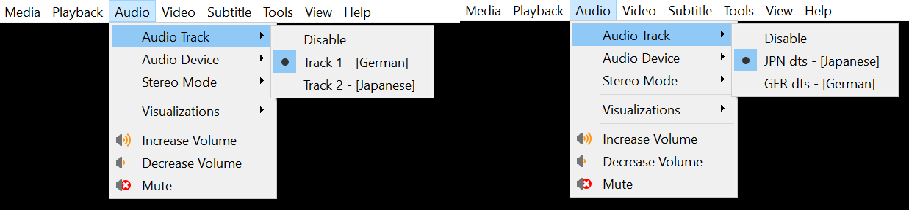
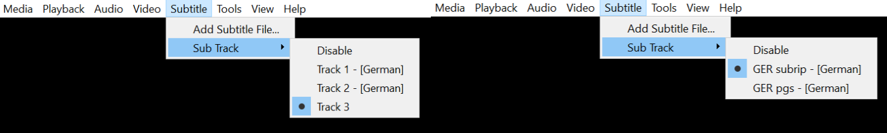

# FFmpegStreamFixer

FFmpegStreamFixer is a Python script designed to manipulate MKV video files, focusing on:

reordering audio and subtitle streams based on user-defined priorities (language and codec type)

optionally adding subrip subtitles 

converting audio codecs and optionally add them

organizing completed files

It can do all of that in one run.

You need to have ffmpeg-python installed.

## Features

- Audio and Subtitle Prioritization: Prioritize and map/order audio and subtitle streams based on language and codec preferences.

- Subtitle Addition: Option to add external subrip files (SRT) to MKV videos.

- Audio Codec Conversion: Convert audio streams to specified codecs and bitrates. Discard the old one or keep them

- File Organization: Option to move completed MKV files to a new directory and rename them.

- Will delete FORCED subtitles.

- Will always default the first stream. (why? some TVs dont care about default tags, they will choose the first stream as default)

- Will delete all audio and subtitle streams that are not in your priority lists

This repository contains example code and scripts provided without warranty or guarantee of any kind. Use of the code is at your own risk. The author assumes no responsibility for any damages or problems that may arise from the use of this code.

